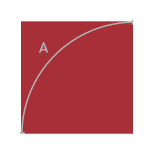

# Codewars JavaScript Solutions

## Area of a Square

Complete the function that calculates the area of the red square, when the length of the circular arc A is given as the input. Return the result rounded to two decimals.



Note: use the π value provided in your language (`Math::PI`, `M_PI`, `math.pi`, etc)

### Solution

```
function squareArea(A){
  const circumference = A * 4;
  const radius = circumference / (Math.PI * 2);
  const area = Number((radius**2).toFixed(2));
  return area;
}
```
