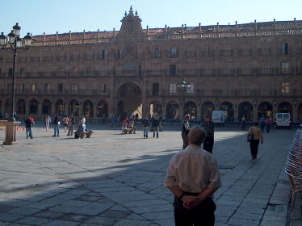
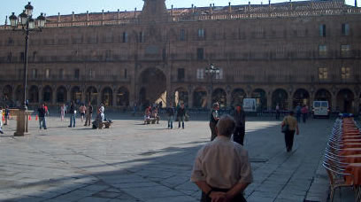

# Codewars JavaScript Solutions

## Aspect Ratio Cropping - Part 1

The aspect ratio of an image describes the proportional relationship between its width and its height. Most video shown on the internet uses a 16:9 aspect ratio, which means that for every pixel in the Y, there are roughly 1.77 pixels in the X (where 1.77 ~= 16/9). As an example, 1080p video with an aspect ratio of 16:9 would have an X resolution of 1920, however 1080p video with an aspect ratio of 4:3 would have an X resolution of 1440.

Write a function that accepts arbitrary X and Y resolutions and converts them into resolutions with a 16:9 aspect ratio that maintain equal height. Round your answers up to the nearest integer.

This kata is part of a series with [Aspect Ratio Cropping - Part 2](https://www.codewars.com/kata/aspect-ratio-cropping-part-2).

### Example

374 × 280 pixel image with a 4:3 aspect ratio.



500 × 280 pixel image with a 16:9 aspect ratio.



### Solution

```
function aspectRatio(x,y){
  let newX = (y * 1.77777).toFixed(1);

  if (Number(newX[newX.length - 1]) < 5 && Number(newX[newX.length - 1]) > 0) {
    return [Number((y * 1.77777).toFixed(0)) + 1, y];
  }
    return [Number((y * 1.77777).toFixed(0)), y];
}
```
